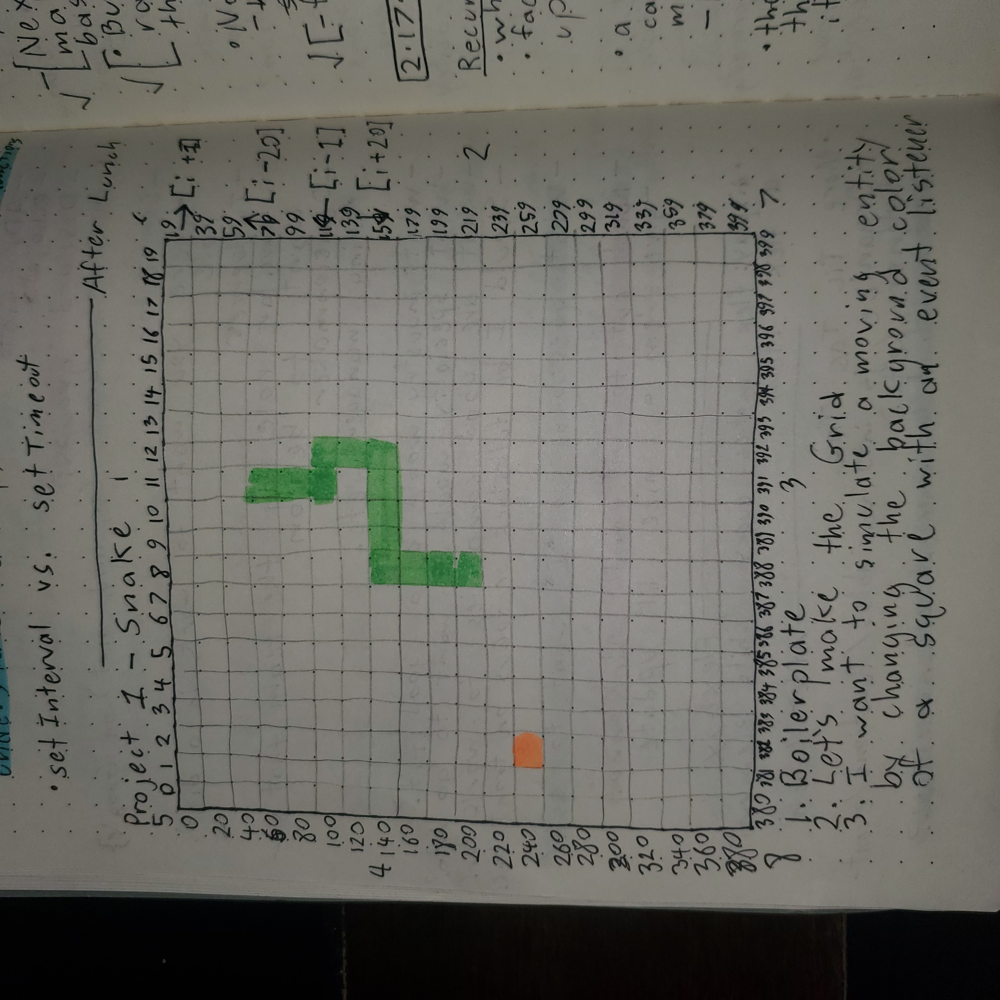

# Snake - in-browser DOM game

## Table of Contents
### 1. Introduction
### 2. User story
### 3. Technologies/description
### 4. Link to the game

---------------------------------------------------------

---------------------------------------------------------

### 1. Introduction
Hi, and welcome to my Snake repo! My name is Luke and I wrote the code. At the time of writing this, I am attending a software engineering immersive and my first project is to design, code, and deploy a video game with the skills I have developed over the past three weeks. Since I love the game of Snake (I have played too much of Google's Snake game while making this), I wanted to test my know-how by making a game that I feel passionate about. Thank you for checking it out!

### 2. User story
As a casual gamer, I want to have a simple, aesthetic webpage where I can play one of my favorite classic games, Snake and track my high score, so I can observe my progress and even compete with my friends.

I want the snake to grow longer each time it grows an apple to have a sense of my progression in the game.

I want the snake to be unable to pass through itself, so that the appearance of the game doesn't become confusing and so that the challenge increases as the snake grows longer.

I want the snake hitting the walls to be a lose condition, and I would like there to be a message in the window letting me know that the snake has crashed and that the game is restarting.

I want the snake to move continuously upon each press of an arrow key, until either the snake is redirected or meets a lose condition.

I want to be able to adjust the speed of the snake.

### 3. Technologies/description
I built out this version of Snake entirely through JS DOM manipulation interacting with some static elements in my HTML and some style-code in my CSS. The snake itself is comprised of a head-number, and an array of numbers representing its tail. These numbers correspond to the indices of my grid of div squares. I have a single event listener to respond to the player/user pressing an arrow key, and moving the snake accordingly by adding and removing CSS classes to and from the div squares

### 4. Link to the game